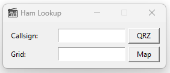

# Ham Lookup

A simple desktop tool for ham radio operators to quickly look up callsigns and Maidenhead grid squares.



## Features

- **Callsign Lookup**: Enter a callsign and open its QRZ.com page
- **Grid Square Lookup**: Enter a Maidenhead grid (e.g., `EM20` or `FN20jb`) and see it on a map

## Installation

### 1. Install Python

**Windows:**
1. Download Python from [python.org](https://www.python.org/downloads/)
2. Run the installer
3. Check "Add Python to PATH" during installation
4. Click "Install Now"

**macOS:**
```bash
brew install python
```
Or download from [python.org](https://www.python.org/downloads/)

**Linux (Debian/Ubuntu):**
```bash
sudo apt install python3 python3-tk
```

**Linux (Fedora):**
```bash
sudo dnf install python3 python3-tkinter
```

### 2. Run the App

```bash
python hamlookup.pyw
```

Or on Windows, double-click `hamlookup.pyw` to run it directly.

## Usage

1. Enter a callsign and press Enter (or click QRZ) to open the QRZ page
2. Enter a grid square and press Enter (or click Map) to see it on a map

## Optional: Custom Icon

The app uses `radio.ico` for its window icon. Replace it with your own if desired.
